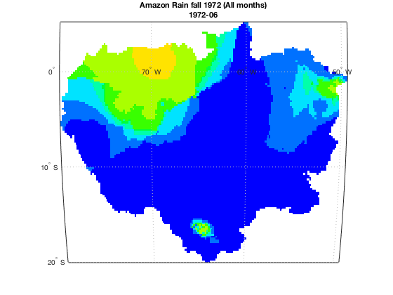

# Tutorial: Access ORNL DAAC WMS Service using Matlab
*Author: ORNL DAAC*
 
*Date: April 2, 2018*
 
*Contact for [ORNL DAAC](https://daac.ornl.gov/): uso@daac.ornl.gov*

##### Keywords:  SDAT, WMS, OGC Web Service, Matlab, Mapping Toolbox
## Overview
In this tutorial, we will explore how to access ORNL DAAC OGC WMS Service using Matlab Plugin [Mapping Toolbox.](https://www.mathworks.com/help/map/) Mapping Toolbox provides tools and utilities for analyzing geographic data and creating map displays. In this example, web-based data is imported from Web Map Service (WMS) servers. WMS provides a simple HTTP interface for requesting geo-registered map images from one or more distributed geospatial databases. The WMS request is also available from data downloading page of ORNL DAAC Spatial Data Access Tool (SDAT). After connecting to ORNL DAAC WMS service, we will find target layer by searching by keywords. For this example, Amazon river basin precipitation 1972-1992 is used for demonstration. Then we will learn how to get available metadata of this WMS service layer. At last, we will walkthrough how to send request to map the data and plot the legend.

## Source Data
The Amazon River Basin precipitation data in 1972 derived from the gauging network operated by the Divisao Nacional de Aguas e Energia Eletrica was used in this tutorial. The original GeoTIFF file is accessible from [ORNL DAAC's Spatial Data Access Tool.](https://webmap.ornl.gov/ogcdown/wcsdown.jsp?dg_id=228_1)
## Prerequisites:
Matlab R2016a or later. Matlab plugin: Mapping toolbox

## Procedure
The Matlab live script can't be previewed in GitHub webpage. The tutorial below is in PDF version just for preview purpose. 
Access the tutorial here:  [Tutorial pdf](sdat_matlab_v1.pdf)

The R scripts are also accessible and downloadable. These two files are just in different format, but have the same contents. 
Access the Matlab scripts here: [Matlab Live Script in .mlx](sdat_matlab_v1.mlx), [Matlab script in .m](sdat_matlab_v1.m)
